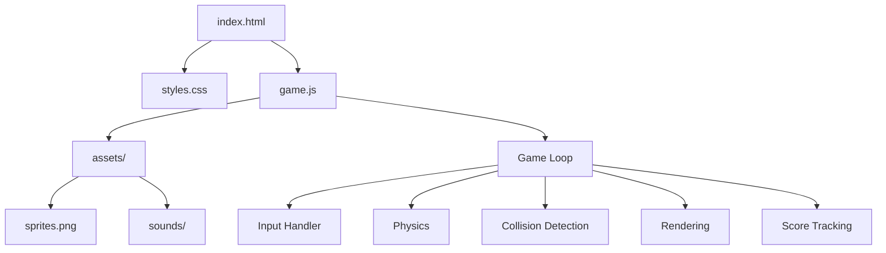
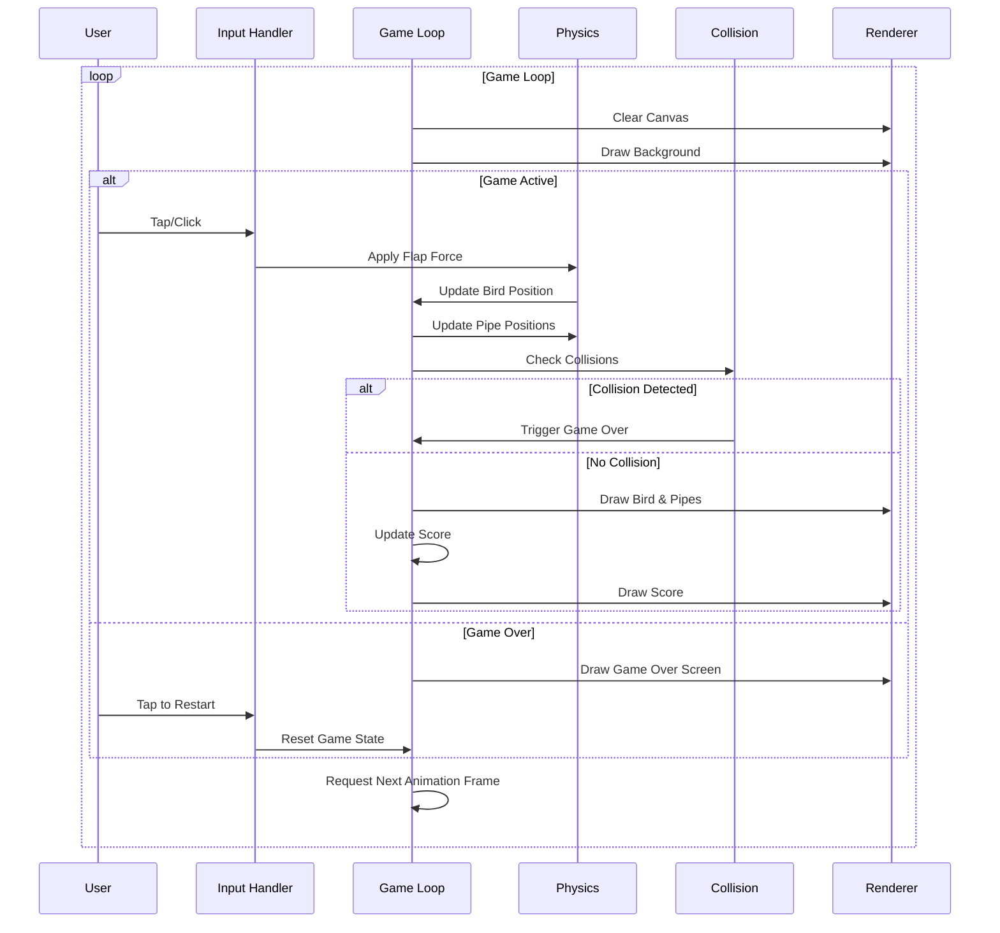

# Flappy Bird Clone - Development Plan

## Project Overview

We'll create a faithful recreation of the original Flappy Bird game with:
- Pixel art graphics matching the original style
- Basic gameplay mechanics (tap/click to flap, navigate through pipes)
- Score tracking
- Game over state with restart option
- Responsive design for both desktop and mobile browsers

## Technical Architecture



## Project Structure

```
flappy-bird/
├── index.html         # Main HTML file
├── styles.css         # CSS for layout and responsive design
├── game.js            # Main game logic
└── assets/
    ├── sprites.png    # Sprite sheet containing all game graphics
    └── sounds/        # Game sound effects
        ├── flap.wav
        ├── score.wav
        ├── hit.wav
        └── die.wav
```

## Development Phases

### Phase 1: Project Setup and Basic Structure
1. Create project directory structure
2. Set up HTML boilerplate with Canvas element
3. Create CSS for responsive layout
4. Initialize basic JavaScript structure

### Phase 2: Asset Creation and Loading
1. Create/obtain pixel art assets (bird, pipes, background)
2. Create/obtain sound effects
3. Implement asset loading system

### Phase 3: Game Mechanics Implementation


1. Implement game loop using requestAnimationFrame
2. Create bird physics (gravity, flapping)
3. Implement pipe generation and movement
4. Add collision detection
5. Implement scoring system

### Phase 4: Input Handling
1. Implement mouse/touch input detection
2. Add keyboard support for desktop
3. Ensure input works across different devices

### Phase 5: Responsive Design and Cross-Browser Testing
1. Implement responsive canvas scaling
2. Test on various browsers (Chrome, Firefox, Safari)
3. Test on different devices (desktop, tablet, mobile)
4. Optimize performance for mobile devices

### Phase 6: Polishing
1. Add sound effects
2. Implement game states (start screen, game over)
3. Add visual feedback (animations, effects)
4. Final testing and bug fixes

## Technical Considerations

### Canvas Scaling
To ensure the game looks good on all devices, we'll implement a scaling system that maintains the pixel art aesthetic while adapting to different screen sizes.

```javascript
// Example scaling approach
function resizeCanvas() {
  const gameRatio = GAME_WIDTH / GAME_HEIGHT;
  const windowRatio = window.innerWidth / window.innerHeight;
  
  if (windowRatio < gameRatio) {
    canvas.style.width = window.innerWidth + 'px';
    canvas.style.height = (window.innerWidth / gameRatio) + 'px';
  } else {
    canvas.style.height = window.innerHeight + 'px';
    canvas.style.width = (window.innerHeight * gameRatio) + 'px';
  }
}
```

### Input Handling
We'll implement a unified input system that works across different devices:

```javascript
// Example input handling
function setupInput() {
  // Mouse events for desktop
  canvas.addEventListener('mousedown', handleFlap);
  
  // Touch events for mobile
  canvas.addEventListener('touchstart', function(e) {
    e.preventDefault(); // Prevent scrolling
    handleFlap();
  });
  
  // Keyboard events (optional)
  document.addEventListener('keydown', function(e) {
    if (e.code === 'Space') handleFlap();
  });
}
```

### Mobile Optimizations
To ensure smooth performance on mobile devices:
- Use sprite sheets to reduce draw calls
- Implement simple collision detection
- Optimize the game loop for mobile performance
- Prevent unwanted browser behaviors (zooming, scrolling)

## Implementation Details

### Game Loop
The core game loop will use requestAnimationFrame for smooth animation:

```javascript
function gameLoop(timestamp) {
  // Calculate delta time
  const deltaTime = timestamp - lastTime;
  lastTime = timestamp;
  
  // Clear canvas
  ctx.clearRect(0, 0, canvas.width, canvas.height);
  
  // Update game state
  update(deltaTime);
  
  // Render game
  render();
  
  // Request next frame
  requestAnimationFrame(gameLoop);
}
```

### Physics
Simple physics system for the bird's movement:

```javascript
function updateBird(deltaTime) {
  // Apply gravity
  bird.velocity += gravity * deltaTime;
  
  // Update position
  bird.y += bird.velocity * deltaTime;
  
  // Handle flapping
  if (bird.flapping) {
    bird.velocity = -flapForce;
    bird.flapping = false;
  }
}
```

### Collision Detection
Basic collision detection between bird and pipes:

```javascript
function checkCollisions() {
  // Get bird hitbox
  const birdHitbox = {
    x: bird.x + 5,
    y: bird.y + 5,
    width: bird.width - 10,
    height: bird.height - 10
  };
  
  // Check pipe collisions
  for (const pipe of pipes) {
    const topPipeHitbox = {
      x: pipe.x,
      y: 0,
      width: pipe.width,
      height: pipe.topHeight
    };
    
    const bottomPipeHitbox = {
      x: pipe.x,
      y: pipe.topHeight + pipe.gap,
      width: pipe.width,
      height: canvas.height - pipe.topHeight - pipe.gap
    };
    
    if (checkHitboxCollision(birdHitbox, topPipeHitbox) || 
        checkHitboxCollision(birdHitbox, bottomPipeHitbox)) {
      return true;
    }
  }
  
  // Check floor/ceiling collisions
  if (bird.y <= 0 || bird.y + bird.height >= canvas.height) {
    return true;
  }
  
  return false;
}
```

## Timeline Estimate

- Phase 1 (Setup): 1 hour
- Phase 2 (Assets): 2-3 hours
- Phase 3 (Game Mechanics): 4-5 hours
- Phase 4 (Input Handling): 1-2 hours
- Phase 5 (Testing & Responsive Design): 2-3 hours
- Phase 6 (Polishing): 2-3 hours

Total estimated development time: 12-17 hours